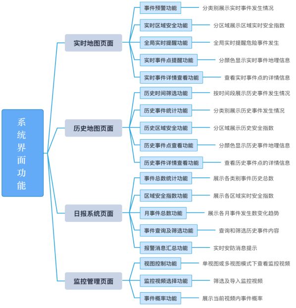

# STA城哨 - 智慧安防系统

本项目是一个基于时空音频感知的智慧安防系统，旨在通过对城市环境中的声音事件进行智能检测和及时反馈报警，提升城市安全管理水平。系统以半监督学习的声音事件感知算法为核心，结合城市声谱地图的可视化呈现，融入传统视频监控，实现对复杂真实环境下声音事件的实时检测、预警、历史数据提取和时空信息统计。

**项目主页 (GitHub Pages):** [点击访问 STA城哨 项目主页](https://setsu1na.github.io/STA/) 
**GitHub 仓库:** [https://github.com/Setsu1na/STA/](https://github.com/Setsu1na/STA/)

## 主要特性

*   **主动声音感知：** 打破传统以视频为中心的被动监控模式，实现对声音事件的主动感知。
*   **实时事件检测：** 基于先进的半监督学习算法 (FBCRNN + Tag-conditioned CNN) 实时检测多种城市声音事件。
*   **声谱地图可视化：** 在地图上直观展示声音事件的发生位置、类型和强度。
*   **"声引视频"联动：** 自动关联声音事件与对应时段的视频片段，便于快速回溯。
*   **多层次系统架构：** 清晰的五层架构（物理层、数据层、支撑层、业务层、应用层）。
*   **丰富的前端交互：** 提供实时地图、历史回放、日报统计、监控管理等功能。
*   **全面的系统测试：** 包括功能、算法准确率、事件边界、系统性能等多维度测试。

## 系统架构

本系统采用五层架构设计：

1.  **物理层：** 安防摄像头与拾音器，负责音视频数据实时采集。
2.  **数据层：** 数据库与缓存机制，保障数据高效、稳定读写。
3.  **支撑层：** 集成核心中间件与技术，如 Flask (后端框架), Flink (流处理), Redis (缓存), FFmpeg (多媒体处理)，为上层业务提供支撑。
4.  **业务层：** 实现数据采集、处理、展示、系统管理等核心业务逻辑。
5.  **应用层：** 通过 Web 可视化平台向用户提供服务。

### 核心算法

*   采用 **FBCRNN (Frequency Band Convolutional Recurrent Neural Network)** 与 **Tag-conditioned CNN (标签条件卷积神经网络)** 结合的半监督学习方法，能够有效利用未标记数据，提升模型在真实复杂环境下的泛化能力和检测准确率。

## 核心技术栈

*   **前端：** HTML5, CSS3, JavaScript, React, Ant Design, Leaflet.js
*   **后端（假设）：** Python, Flask (或其他Web框架)
*   **数据处理（假设）：** Flink, Redis
*   **机器学习/声音处理（假设）：** 相关Python库 (e.g., Librosa, PyTorch/TensorFlow), FFmpeg

## 项目模块与功能

项目主页 (`index.html`) 主要展示了以下模块：

1.  **项目简介 (`#intro`)：** 概述项目目标、意义和核心理念。
2.  **技术与系统架构 (`#tech-arch`)：** 详细介绍五层系统架构和核心算法。
    *   1.1 系统总体架构
    *   1.2 核心算法详解
    *   1.3 典型应用场景
        *   
    *   1.4 项目创新点
        *   
3.  **工作流程 (`#workflow`)：** 描述系统从数据采集到报警反馈的完整工作流程。
    *   
4.  **网络拓扑架构 (`#network-topo`)：** 展示系统的网络部署结构。
    *   
5.  **系统测试 (`#testing`)：** 展示系统的功能测试、算法准确率比较、事件类别和时间边界测试、以及其他性能测试结果。
    *   *(详细图表请参见项目主页)*
    *   
    *   
    *   
    *   
6.  **系统界面功能 (`#interface`)：** 介绍 Web 端安全监控平台的四大主要功能页面及其子功能。
    *   *(详细截图请参见项目主页)*
    *   
7.  **前端演示 (`#demo`)：** 提供系统前端主要功能和交互流程的视频演示。

## 如何贡献

欢迎对本项目进行贡献！您可以通过以下方式参与：

*   报告 Bug 或提出功能建议 (通过 Issues)。
*   提交 Pull Requests 改进代码或文档。
*   分享您的使用经验。

## 联系方式

如果您有任何问题或建议，可以通过以下方式联系我们：
*   GitHub Issues: [https://github.com/Setsu1na/STA/issues](https://github.com/Setsu1na/STA/issues)
*   邮箱: setsu.1nal@gmail.com

---

感谢您对 STA城哨 项目的关注！ 